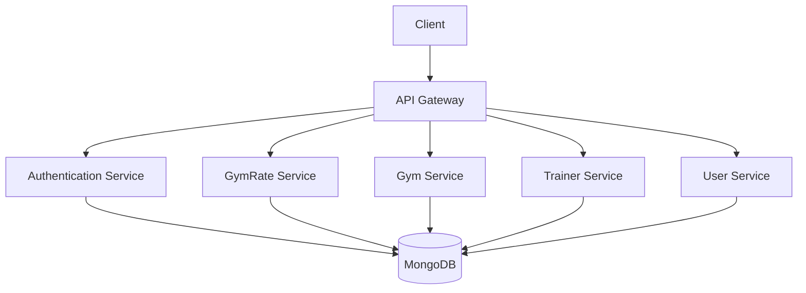
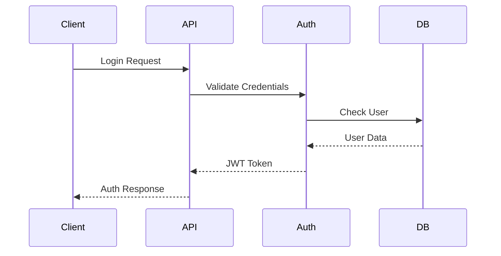
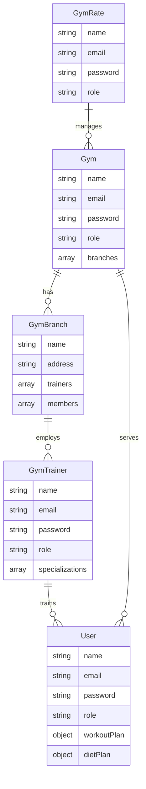
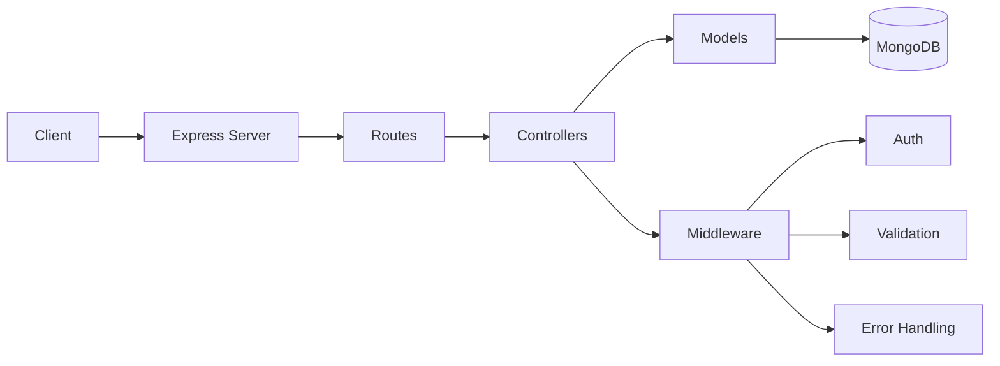
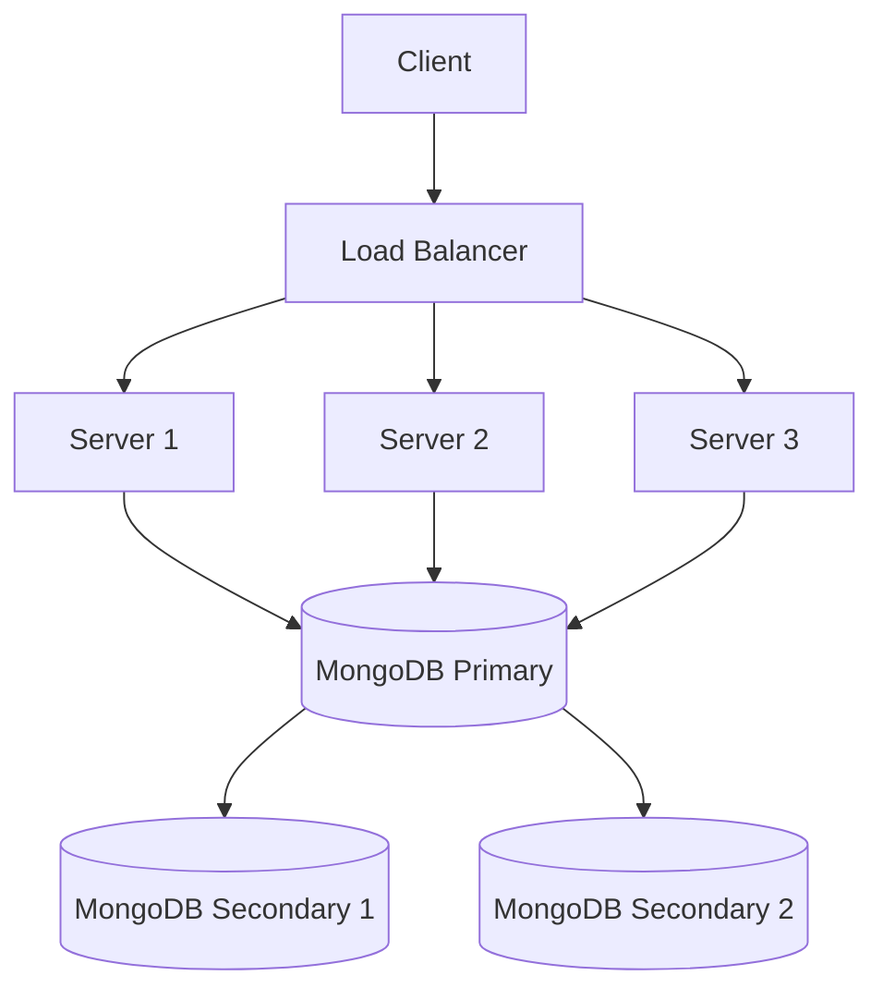
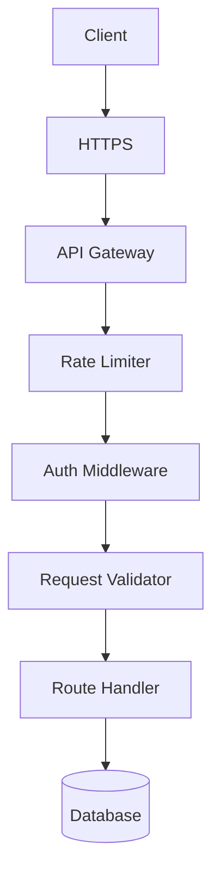

# Architecture Documentation

## System Overview



## Authentication Flow



## Data Model



## API Architecture



## Deployment Architecture



## Security Architecture



## Component Details

### 1. API Gateway
- Request routing
- Load balancing
- Rate limiting
- CORS handling
- Request validation

### 2. Authentication Service
- JWT token generation
- Token validation
- Role-based access control
- Session management
- Password hashing

### 3. GymRate Service
- Gym management
- Analytics
- User management
- System configuration
- Reporting

### 4. Gym Service
- Branch management
- Trainer management
- Member management
- Subscription handling
- Facility management

### 5. Trainer Service
- Member assignment
- Progress tracking
- Schedule management
- Review system
- Plan management

### 6. User Service
- Profile management
- Progress tracking
- Plan following
- Booking system
- Payment handling

## Database Schema

### Collections

#### GymRate Collection
```javascript
{
  _id: ObjectId,
  name: String,
  email: String,
  password: String,
  role: String,
  profilePicture: String,
  contactNumber: String,
  isActive: Boolean,
  lastLogin: Date,
  settings: Object
}
```

#### Gym Collection
```javascript
{
  _id: ObjectId,
  name: String,
  email: String,
  password: String,
  role: String,
  createdBy: ObjectId,
  branches: [ObjectId],
  address: Object,
  contactNumber: String,
  subscription: Object,
  settings: Object
}
```

#### GymBranch Collection
```javascript
{
  _id: ObjectId,
  name: String,
  gym: ObjectId,
  address: Object,
  trainers: [ObjectId],
  members: [ObjectId],
  facilities: Array,
  operatingHours: Object,
  capacity: Number
}
```

#### GymTrainer Collection
```javascript
{
  _id: ObjectId,
  name: String,
  email: String,
  password: String,
  role: String,
  branch: ObjectId,
  gym: ObjectId,
  specialization: Array,
  experience: Object,
  schedule: Object,
  rating: Object
}
```

#### User Collection
```javascript
{
  _id: ObjectId,
  name: String,
  email: String,
  password: String,
  role: String,
  branchId: ObjectId,
  trainerId: ObjectId,
  workoutPlan: Object,
  dietPlan: Object,
  progress: Array
}
```

## Security Measures

### 1. Authentication
- JWT-based authentication
- Password hashing with bcrypt
- Role-based access control
- Token expiration
- Secure password reset

### 2. Authorization
- Role-based middleware
- Resource ownership validation
- API key authentication
- OAuth2 integration
- Session management

### 3. Data Protection
- Input validation
- Output sanitization
- SQL injection prevention
- XSS protection
- CSRF protection

### 4. API Security
- Rate limiting
- Request validation
- CORS configuration
- Security headers
- SSL/TLS encryption

## Performance Optimization

### 1. Caching Strategy
- Redis caching
- Response caching
- Query caching
- Session caching
- Static file caching

### 2. Database Optimization
- Indexing strategy
- Query optimization
- Connection pooling
- Data aggregation
- Sharding strategy

### 3. Load Balancing
- Round-robin distribution
- Health checks
- Session persistence
- SSL termination
- Request routing

## Monitoring and Logging

### 1. Application Monitoring
- Performance metrics
- Error tracking
- User analytics
- Resource usage
- API metrics

### 2. System Monitoring
- Server health
- Database performance
- Network traffic
- Security events
- Resource utilization

### 3. Logging Strategy
- Error logging
- Access logging
- Audit logging
- Performance logging
- Security logging 